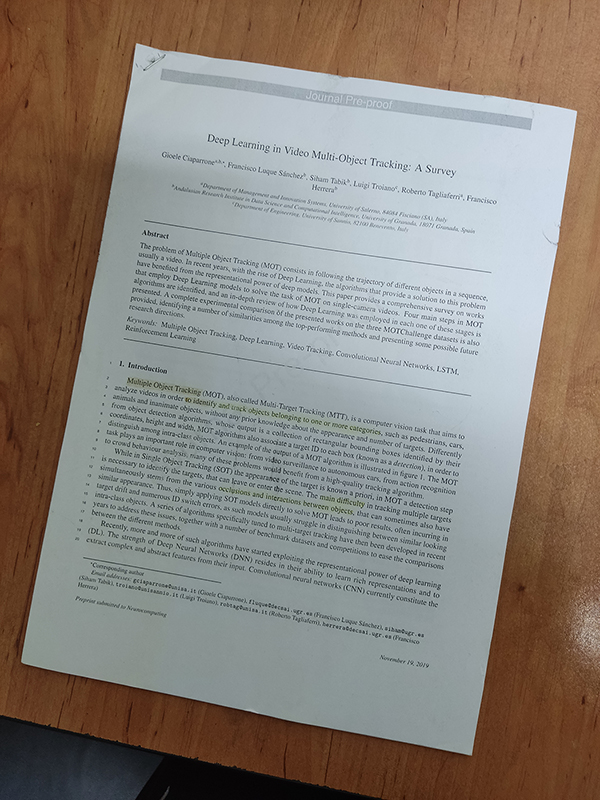

# 📄 Python Document Scanner (CamScanner Clone)

A multi-stage image processing pipeline built with Python and OpenCV to automatically detect, crop, and enhance documents from an image, replicating the functionality of applications like CamScanner. This project is implemented in a Jupyter Notebook.

## 🌟 About The Project

The goal of this project is to create an algorithm that can take a photograph of a document taken at an angle and transform it into a clean, top-down, and enhanced "scanned" image. This involves a pipeline of computer vision techniques to identify the document's boundaries, correct its perspective, and improve its readability.

### 🎯 Key Features

*   **Automatic Document Detection:** Finds the largest quadrilateral contour in an image, assuming it is the document.
*   **Perspective Correction:** Warps the detected document region into a flat, top-down view.
*   **Image Enhancement:** Applies a series of filters to improve the contrast, brightness, and sharpness of the final scanned image.
*   **Built entirely with Python, OpenCV, and NumPy within a Jupyter Notebook.**

---

## ⚙️ The Processing Pipeline

The document scanning process is broken down into several distinct stages:

**1. Grayscale Conversion & Blurring**
*   The input image is first converted to grayscale, as color information is not needed for edge detection.
*   A **Gaussian Blur** is applied to the grayscale image to smooth it and reduce high-frequency noise, which helps in achieving a more accurate edge detection.

**2. Canny Edge Detection**
*   The **Canny edge detector** is used on the blurred image to identify the boundaries of the document. This algorithm is effective at finding sharp changes in intensity.

**3. Contour Detection and Filtering**
*   `cv2.findContours` is used to find all closed shapes in the edge map.
*   The contours are sorted by area in descending order, and the largest one is assumed to be the document.
*   The contour is approximated to a polygon. If this polygon has exactly four vertices, it is identified as the target document outline.

**4. Perspective Transformation**
*   Once the four corners of the document are identified, a **perspective transform** is calculated using `cv2.getPerspectiveTransform`.
*   This transformation matrix is then applied to the original image using `cv2.warpPerspective` to obtain a corrected, top-down view of the document.

**5. Final Image Enhancement**
*   To make the final output look like a high-quality scan, a multi-step enhancement process is applied:
    *   **Gamma Correction:** Subtly brightens the image and enhances mid-tone contrast.
    *   **Adaptive Histogram Equalization (CLAHE):** The image is converted to the LAB color space, and CLAHE is applied to the Luminance (L) channel to improve local contrast without over-amplifying noise.
    *   **Saturation & Sharpness Boost:** The image is further refined by boosting color vibrancy and applying a sharpening filter to enhance text clarity.

---

## 📊 Results

The pipeline successfully transforms a raw photograph of a document (`images/example.jpg`) into a clean, flat, and highly readable scanned version (`result images/final.jpg`).

Below is a direct comparison of the input and the final enhanced output.

### Before vs. After

| Before: Original Photo (`images/example.jpg`) | After: Final Enhanced Scan (`result images/final.jpg`) |
| :-------------------------------------------: | :----------------------------------------------------: |
|     |  |

This transformation is achieved through the multi-step processing pipeline detailed above. The final output is correctly oriented, free of perspective distortion, and features enhanced contrast, making the text sharp and legible.

---

## 🚀 How To Use

To run this project, you will need a Python environment with Jupyter Notebook installed.

1.  Clone the repository:
    ```bash
    git clone https://github.com/arashnasresfahani/Python-Document-Scanner-OpenCV
    ```
2.  Navigate into the project directory:
    ```bash
    cd python-document-scanner-opencv
    ```
3.  Install the dependencies:
    ```bash
    pip install -r requirements.txt
    ```
4.  Start the Jupyter Notebook server:
    ```bash
    jupyter notebook
    ```
---

## 📦 Dependencies

All necessary libraries are listed in the `requirements.txt` file.